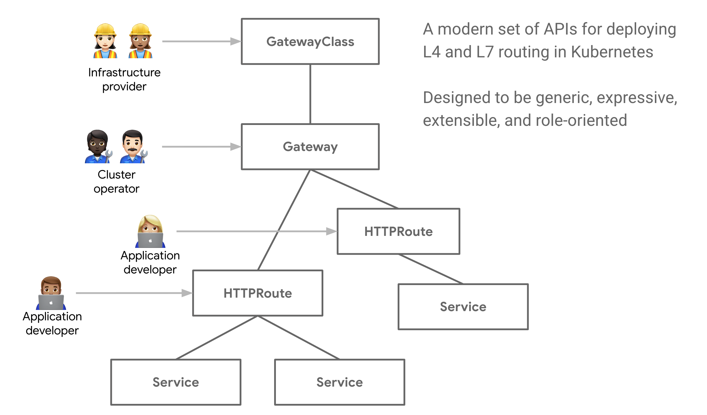
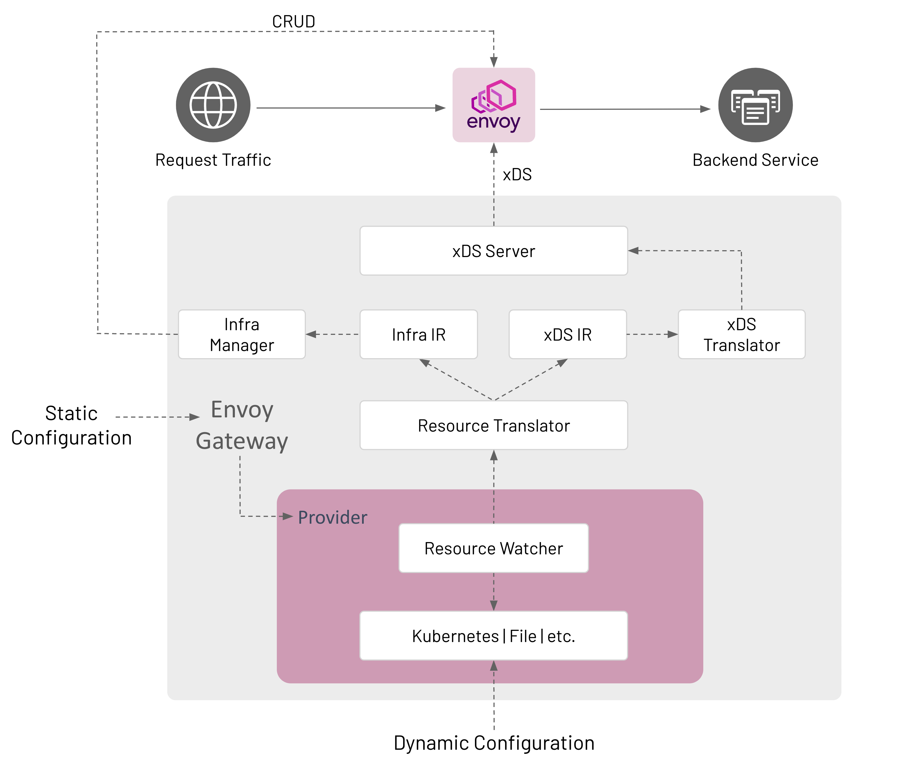

# Envoy Gateway 学习

## 项目背景

### 发起

Envoy Gateway （以下简称 EG）是由 Tetrate、（Contour ）VMware、（Emissary）Ambassador Labs 这三家共同发起的。

### 定位

Envoy Gateway 本质上是一个控制面，数据面为 EnvoyProxy。它的定位是作为一个**轻量级的南北网关**，轻量化、易扩展、可观测性、中立，是 EG 的主题。



运维只需要关注 Gateway 和 GatewayClass，而开发只需要关注各种 Route。

## 项目架构

### 组成结构



Envoy Gateway 是一个单进程模型，各个内部的 Component 是以协程的方式工作，主要是有这几个组件组成：

- Provider：提供从 Kubernetes、File、配置中心 List / Watch Gateway API 资源的能力。
- Gateway API Translator：提供将 Gateway API 资源翻译为 IR 的能力，IR 全称 Intermediate Representation，可以理解为资源的中间状态，EG 的 IR 分为两类：Infra IR 和 xDS IR。Infra IR 包含的主要是资源相关的信息，如 EnvoyProxy 的 Deployment、Service 等资源的关键信息。xDS IR 包含主要是下发到 EnvoyProxy 的 xDS 信息。
- Infra Manager：提供将 Infra IR 转化为实际的 Kubernetes 资源，对集群中的资源 create/update/delete 进行管理。
- xDS Translator：提供将 xDS IR 转化为 go-control-plane xDS API 的能力。
- xDS Server：作为实际的 xDS gRPC Server，下发 xDS 信息至数据面的 EnvoyProxy。

## 本地开发 & 调试

当修改代码后，需要一个集群去部署和测试 EG，如果没有现有的集群，可以执行：

```shell
make create-cluster
```

会创建一个 kind 集群并部署 metallb。

当集群准备好之后，首先需要构建 Dev 镜像并推送到镜像仓库，通过执行以下命令：

```shell
IMAGE=docker.io/bitliu/gateway-dev BINS=envoy-gateway TAG=latest make push-multiarch
```

`IMAGE` 需要替换为自己的镜像仓库名称，`TAG` 是此构建镜像的 TAG，此时最新的镜像 `docker.io/bitliu/gateway-dev:latest` 就会被构建并推送到镜像仓库中。

接着，需要指定镜像为此构建镜像对 EG 进行部署，执行以下命令：

> `IMAGE` 和 `TAG` 需和上一步保持一致

```shell
IMAGE=docker.io/bitliu/gateway-dev TAG=latest make kube-deploy 
```

EG 也提供了一个命令快速部署一个 demo 到集群中：

```shell
make kube-demo
```

可以基于此 demo 做快速验证。

此时，基于代码修改的 EG 就会部署在集群中了，然后你就可以基于此部署对修改进行验证。

当你的修改涉及 Envoy Gateway Types 时（CRD API），请记得执行以下，更新 deepcopy 和 manifests：

```shell
make manifests generate
```

当测试结束后，可以清理测试资源：

清理 Demos：

```shell
make kube-demo-undeploy
```

清理 EG：

```shell
make kube-undeploy
```

### egctl 本地开发

egctl 的测试相比 envoy gateway 就简单很多，当你的代码修改是基于 egctl 时，可以执行以下命令去构建 egctl 最新的 binary 做测试：

```shell
 make build BINS="egctl"
```

生成的二进制文件会在 `bin/{GOOS}/{GOARCH}/egctl`。

