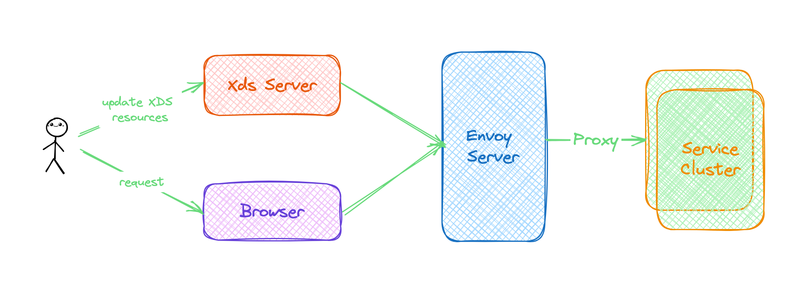

# Envoy 和 XDS 的使用示例

## Envoy 代理配置

> 参考 `docker-compose/envoy/conf` 目录下的 `envoy.yml 等其他 配置文件。 
>
> files 文件夹是以多配置文件的形式动态配置 envoy.cds&lds 资源。
>
> xds 目录下是以 go 和 java 分别实现的 xds api 。

## XDS 实现

### Xds 介绍

DS ，[Discovery Service](https://www.envoyproxy.io/docs/envoy/latest/intro/arch_overview/operations/dynamic_configuration)，即服务发现。xDS 表示一组 DS 的统称。具体如下：

| 简称 | 全称                         |
| ---- | ---------------------------- |
| LDS  | Listener Discovery Service   |
| RDS  | Route Discovery Service      |
| CDS  | Cluster Discovery Service    |
| EDS  | Endpoint Discovery Service   |
| ADS  | Aggregated Discovery Service |
| HDS  | Health Discovery Service     |
| SDS  | Secret Discovery Service     |
| MS   | Metric Service               |
| RLS  | Rate Limit Service           |

xDS 通过 gRPC 来进行通信，在 Istio 中，Polit 组件就实现有 xDS 协议。

xDS 的目的是通过 API 来动态更新 Envoy 的配置。相比 Nginx 网关只能通过手动 reload 来更新配置。

### xDS API

xDS API 在 envoy 中被称为 `Data plane API`（数据面 API）。

其代码保存 envoy 仓库：地址 https://github.com/envoyproxy/envoy/tree/master/api/envoy/api/v2

用户可以根据 proto 描述文件自行生成相对应语言的 GRPC 代码文件。

Envoy 官方提供了两份 xDS Server 的实现，分别是：

- [go-control-plane](https://github.com/envoyproxy/go-control-plane) 基于Golang 的 xDS Server 实现代码；
- [java-control-plane](https://github.com/envoyproxy/java-control-plane) 基于 Java 的 xDS Server 实现代码。

另外，官方还把 API 的定义代码从 Envoy 的源码库中提取出来，放在了 https://github.com/envoyproxy/data-plane-api

> 两种方式都以 LDS 和 CDS 为例编写。其中准备了两个 nginx 应用，来完成通过 xds server 来动态更新 envoy 配置的测试。

#### Golang 实现

> 参考 `xds/golang-xds-impl` 项目。

#### Java 实现

> 参考 `xds/java-xds-impl` 项目。

### XDS 更新 envoy 的 示意图

