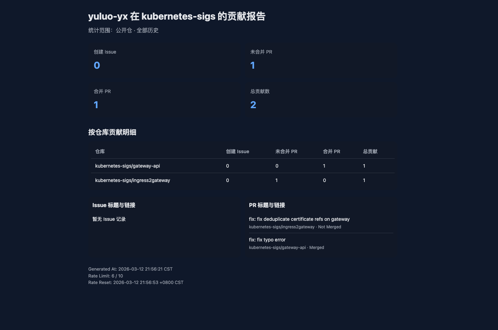

# Github 组织贡献收集器

收集指定用户在指定组织的贡献并以 HTML 形式展示。

```shell
go run . --user antfu --org vuejs --output html --out-file report.html
```

默认会在生成 HTML 后启动本地 Web 服务（`http://localhost:8080`）并自动打开浏览器。

常用参数：
- `--serve=false`：只生成文件，不启动服务
- `--serve-port=9090`：指定服务端口
- `--open-browser=false`：不自动打开浏览器

支持统计项：
- 创建 Issue 数
- 未合并 PR 数
- 合并 PR 数

页面包含两部分：
- 汇总卡片（Issue/未合并PR/合并PR/总贡献）
- 按仓库贡献明细表（每个仓库的三项分布与总贡献）
- Issue/PR 标题与链接摘录（PR 会标记是否已 merged）

可选 Token（提高速率限制）：

```shell
export GITHUB_TOKEN=your_token_here
go run . --user yuluo-yx --org kubernetes-sigs --output html --out-file report-kubernetes-sigs.html
go run . --user yuluo-yx --org kubernetes --output html --out-file report-kubernetes.html
```


