# 神经网络的理解

> 尝试理解神经网络的工作原理！

## 分类问题引入

### 少维度分类

如下图是一个北京和长治的房价对比图：

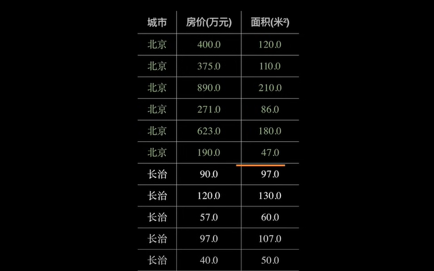

如上使用表格的形式表示，可能不是很直观。换成如下的坐标系就能很清楚的看出来区别：

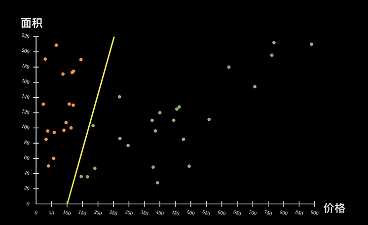

图中标注一条黄色的数据线，可以看出，黄线左边的属于北京，右边的属于长治。

我们可以将问题进一步分析，使其变得更简单：在日常生活中，根据我们的经验知道，决定房子价格的因素其实是
$$
价格/面积 = 平方价
$$
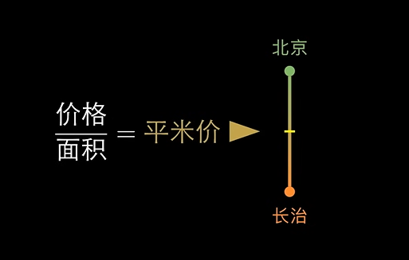

高者属于北京，低的则是长治。为此，我们可以找到一个阈值，将其进行划分。

> **上述就是最简单的分类问题，只有价格和面积两个维度。**

### 多维度分类

在现实生活中，判断房子值不值得购买。不可能只有 **房价 & 面积** 两个因素，可能还有 **楼层、通勤、年限、环境** 等其他因素。问题的本质还是一样的，最终我们都是根据对这些数据进行分析，判断值不值得购买。

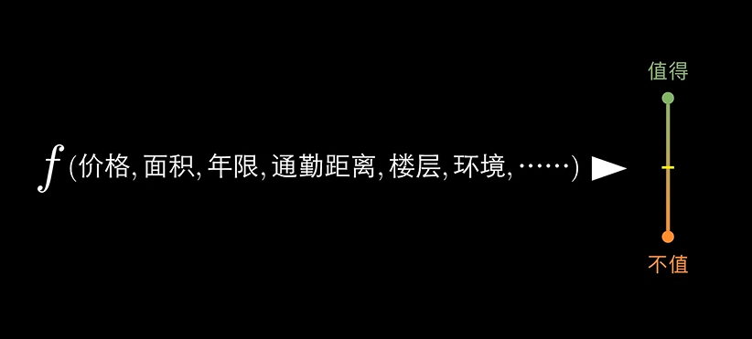

> 这个阈值怎么寻找，用什么样的方式去判定。或者说这个函数是什么样子？

#### 推导数学结论

这里，我们设 房价 = x，面积 = y：
$$
设 房价 为 x，面积 为 y。 

则有
	x / y = 平米价
$$
设将北京和长治区分开的阈值为 `0.69` ，则 `x/y > 0.69` 就是北京，反之则是长治。 

接下来我们将公式变形，即可得到函数 f 的函数表达式
$$
f(x,y) = x - 0.69y = 0
$$
从公式我们可以看出，这时候的阈值变成了 `0`，大于  `0` 表示北京，小于表示长治。这里只考虑了房价和面积两个因素。更现实的情况是：因为其他因素的参与，阈值可能不会恰好等于 `0`，可能是 `101`。这里我们就可以加入一个`偏移量` 对阈值进行校准。
$$
f(x,y) = x - 0.69y - 101 = 0
$$
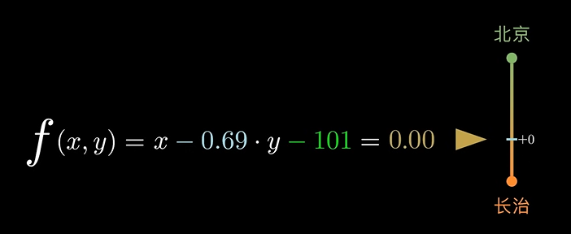

此时，我们观察这个函数表达式：

如果 y 的取值增加了 100，函数值势必发生变化。但是只要同时对 x 的值做出修正，就可以抵消函数值发生的变化，即
$$
f(x,y) = x - 0.69y - 101 = 0 \\
     [+69]  \quad   [+100]
$$
此时，在函数 f 中，x 的 +69 和 y 的 -100 在数学关系上等价。但是在物理意义上，x 代表的是房价，y 代表的是面积。`单位/量纲` 不同，无法进行公度。
$$
f(x,y) = x - 0.69y - 101 = 0 \\
     [+69]  \quad   [+100]  \\
    (万元)   \quad   (米^2)
$$
在当前的函数中，他们是可以进行换算的，因为他们都对函数 f 的取值做出了贡献。换算的方式来自于对函数值贡献的大小。即：

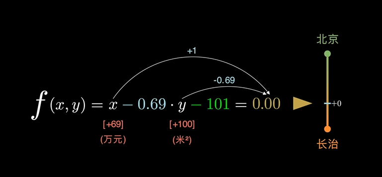

从中可以看出，x 和 y 对函数值的贡献正好是 x 和 y 的系数。

回头看将才数据维度很多的情况：
$$
设 数据维度依次为 x_1, x_2, x_3.....  \\
则 \\
f(x_1, x_2, x_3, x_4...) = x_1 + x_2 + x_3 + x_4 + b  \\\\
根据上述对 x 和 y 的推导，我们可以将其变成：\\\\
w_1x_1 + w_2x_2 + w_3x_3 + w_4x_4 + ... + b = y
$$
其中函数值 y 就是房子是否值得购买的依据。

根据上面我们的推导，这样的函数是有意义的：

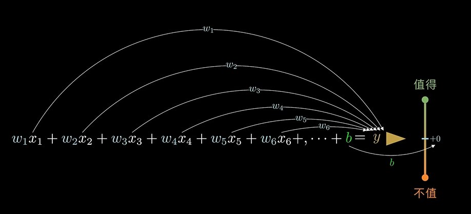

w 的系数为对函数值的贡献程序，b 为阈值的偏移量。

> 规范数学表达为：w -> 权重系数、b -> 偏置系数。

在坐标系中表达为：（为了画图方便，回到二维系数表达）

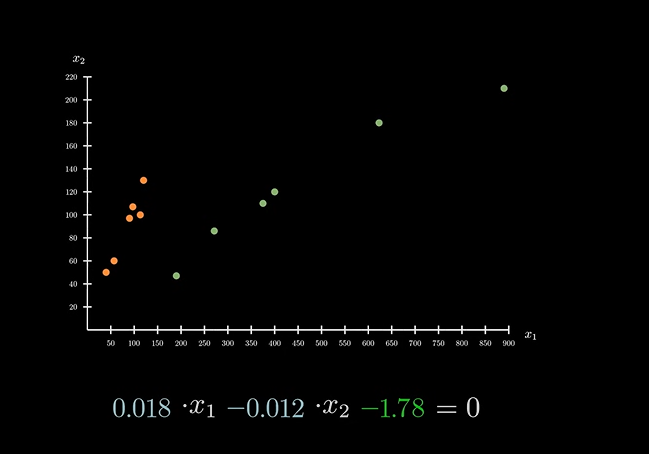

前面讨论的阈值即为下图中的分界线：

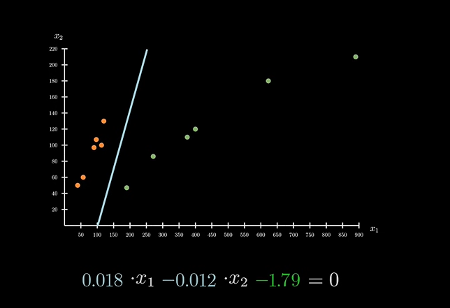

#### 加入参数升维

根据数学原理，不同的阈值即代表了不同的分界线。当这条直接确定下来之后，对数据的划分也随之确定。将不同的系数带入变量 x 和 y 就可以得到不同的结果。

如果我们引入更多的维度系数，对坐标系升维。则：

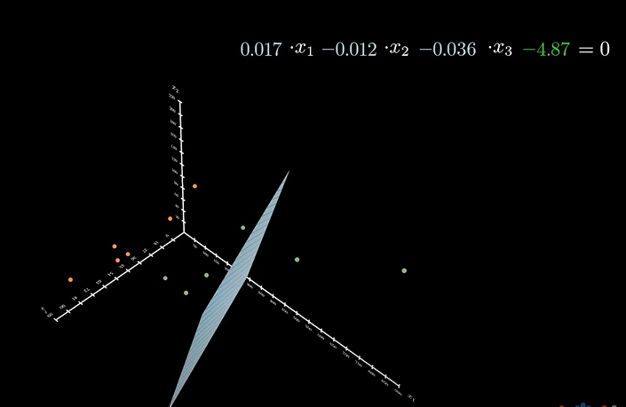

在更高维度中，经常使用向量和矩阵的表达形式：
$$
w_1x_1 + w_2x_2 + w_3x_3 + w_4x_4 + \cdots + b  \\ \\
将其转化为向量和矩阵的表达式为：\\\\
\left[
\begin{matrix}
w_1 & w_2 & w_3 & w_4 & \cdots
\end{matrix}
\right]
·
\left[
\begin{matrix}
x_1 \\ x_2 \\ x_3 \\ s_4 \\ \cdots
\end{matrix}
\right]
+b \\\\
代表行向量和列向量逐项相乘，再相加 \\
为了让表达形式更加紧凑，通常对行向量进行转置，再进行点积运算：\\\\
\left[
\begin{matrix}
w_1 \\ w_2 \\ w_3 \\ w_4 \\ \cdots 
\end{matrix}
\right]^\mathrm T
·
\left[
\begin{matrix}
x_1 \\ x_2 \\ x_3 \\ s_4 \\ \cdots
\end{matrix}
\right]
+b \\\\

通常向量和矩阵，通常使用大写字母来表示，即：\\\\
f(X) = W^\mathrm T · X + b \\

另外一种表达形式是将偏置系数同样写进到矩阵中： \\\\
\left[
\begin{matrix}
w_1 \\ w_2 \\ w_3 \\ w_4 \\ \cdots \\ b
\end{matrix}
\right]^\mathrm T
·
\left[
\begin{matrix}
x_1 \\ x_2 \\ x_3 \\ s_4 \\ \cdots \\ 1
\end{matrix}
\right] \\\\
函数表达式为：\\
f(X) = W^\mathrm T · X
$$
在前面的讨论中，确定了数据的阈值（分界线之后）。下一步行为在 `机器学习` 中称为 **决策/预测**。对于一个新输入的数据，通过 x 和 y 在坐标系中的位置来判断处于分界线哪一边。在程序中，并不能直接去看图像。而是要将参数值代入到函数中，计算出函数值，和 0 比较，进行判断。

> 到这一步，机器学习的问题变得相对简单，而机器学习的难点是在于如何确定一条最好的分界线，即确定阈值。这个过程叫做**训练/学习**。和动规，贪心等算法不同的是，**机器学习只需要在刚开始时对大量复杂的数据进行计算，确定出来关系。在面对新数据时，只需要进行简单的运算就可以达成目标。**那么，机器学习并没有减少算法的复杂度，相比之下而言，只是提高的 决策/训练 的应用效能。
>
> 所以接下来，我们将了解如何去`训练和学习`。

## 训练 & 学习

> 训练/学习 的目的很明确，即在坐标系中确定这条分界线！同样，机器学习的难点也在这里。

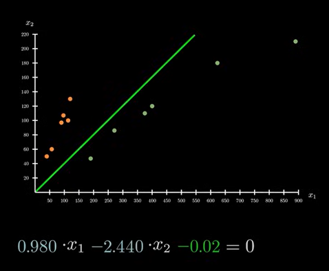

如图，上述两条直线，都能对现有数据进行完美划分。但是哪条直线是最优解？往往现实情况并不是这样，而是下图所示：

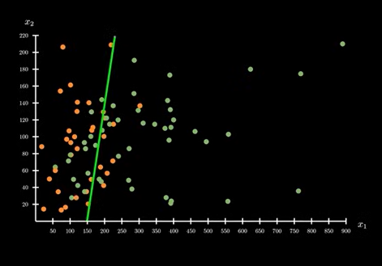

即不存在这样的最优解，可以将数据进行完美划分。只能从现有的直线中，挑选一条符合大多数情况，能将大多数数据区分开的直线。

那么如何确定这条直线是不是符合现有的预期？对此，**就需要有一个判断分界线好坏的判断标准。**在面对不同的数据集时，挑选出的直线可能不同，如上图所示。随着越来越多的数据，直线也会随之变化。**注意：机器学习的目的是预测，而不是训练。**在当前的数据集范围中，只能做到当前情况分界线最好，并不能保证对新来的数据也是最好。这也是选择`判断标准`最困难的地方。当我们选择了一个判断标准之后，标准之中就包含了我们对未来数据的一种预测。这个预测无法在数学逻辑上找到答案，所以要想解决这个问题，就必须要引入**额外的公设**。

### 引入额外公设

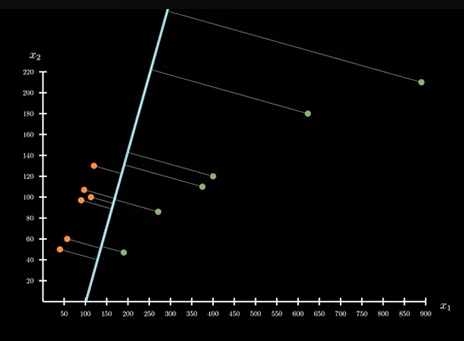

从图中看，每个点到分界线的距离大小不一，所有这些点中，对分界线最小的哪一个，我们可以把它看作是分界线对数据划分的间隔：

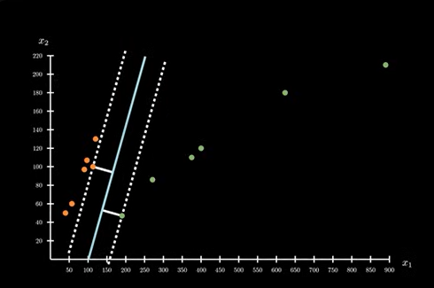

通过已有的直觉判断，应该是分界线到点的距离越大越好。其中的间隔可以容纳更多的点。

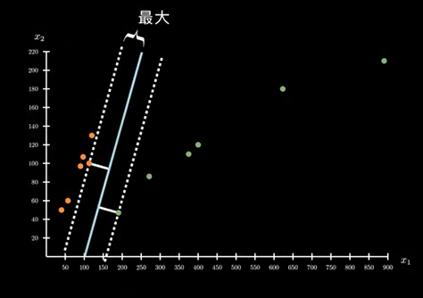

#### 公设条件 1

因此，我们可以提出这样一个公设：**间隔越大越好**

那么，这里的间隔如何计算，我们需要将其交给计算机去判断，所以我们需要找到间隔计算的表达式：

1. 我们需要知道点到直线的距离 ，表达式为（带入 x 和 y 无法直接得到点到直线的距离，需要做一些修饰）：
   $$
   \frac{1}{\begin{Vmatrix}W\end{Vmatrix}}_2\begin{vmatrix}f(X)\end{vmatrix} \\\\
   {\begin{Vmatrix}W\end{Vmatrix}}_2 （权重系数的 L_2 范数）这里的 L_2 范数可以理解为 勾股定理在更高维度上的扩展，即 \\\\
   {\begin{Vmatrix}W\end{Vmatrix}}_2 = \sqrt{w^2_1+w^2_2+w^2_3+w^2_4+\cdots} \\\\
   对向量里的每个分量进行平方在开方。
   $$

2. 对上述的每个点进行 1 的运算，即可得到所有点到直线的间隔（用 M(W) 来表示直线间隔函数）：
   $$
   M(W)=\underset {i=1,2,3 \cdots N}{min}\frac{1}{\begin{Vmatrix}W\end{Vmatrix}}_2\begin{vmatrix}f(X^{(i)})\end{vmatrix} \\\\
   $$

3. 将所有数据带入上述公式，在不考虑机器算力的情况下，计算机就可以完成这些计算。

进行上述操作之后，我们就能得到的结果。这一切的前提是我们对 `f(x)` 这样的函数值进行了上述修饰。既然这里是公设，那么它就不唯一。这里还可以有第二种公设。同样，我们能偶利用的只有函数值，仍然对其进行修饰，得出前提假设。

这次的修饰是对其进行 `sigmoid(f(x))` 操作：
$$
sigmod(f(x)) \in (0,1)
$$

通过 `sigmoid 操作`，可以将函数值缩放到 `0 ~ 1` 之间。`sigmoid`函数图像如下：

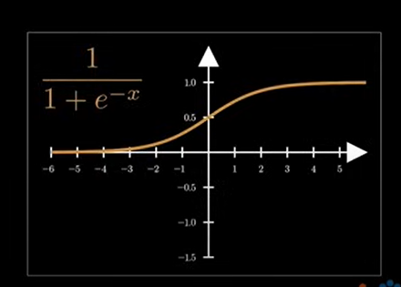

定义域为全体实数，值域为 `0 - 1` 的开区间。`0 - 1` 的开区间，很容易让我们想到概率，那么我们是否可以把经过修饰后的函数值看作是一个概率值呢？

#### 公设条件 2

我们将函数值看作是如下的条件概率：
$$
P(X = X^{(i)} \mid W)=sigmod(f(x^{(i)}))
$$
这个概率的意义就代表了某一个数据在北京还是长治的可能性。

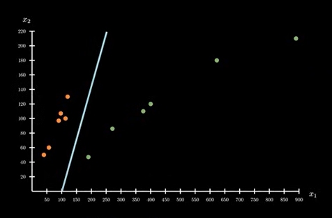

在当前的数据情况下，北京的函数值大于 0 ，长治的函数值小于 0 。
$$
北京：P(X = X^{(i)} \mid W)=sigmod(f(x^{(i)}))  \\\\
长治：P(X = X^{(i)} \mid W)=sigmod(-f(x^{(i)}))  \\ 长治的函数值小于 0 ，所以要对函数值取附属再进行 sigmoid 操作。 \\\\
概率值越大就表明属于 “北京/长治” 的可能性越大，反之则越小。
$$
基于当前的理解，我们就可以提出新的公设条件（第二种公设）：

**概率（似然）值最大最好**

概率值最大，就应该是所有点的概念都最大，他们是相乘的关系。即我们需要找的就是当
$$
\underset{W} {max} \prod_{i=0}^N P(X = X^{i}\mid {W})· \prod_{j = 0}^M P(X = X^{(i)} \mid {W})
$$
表达式取值最大时，系数 W 的值。上述表达式最常见的形式是：使用 `log` 运算符将连乘变为连加。

第三种公设：现在我们可以假想出一个如下的函数 `T(X)` ，它可以对数据进行完美分类。
$$
T(X)=
\begin{cases}
1: X \in {北京} \\
0: X \in {长治}
\end{cases}
$$

任何一个数据的输入，都可以完美的判断出它属于北京还是长治。北京的函数值为 1 ，长治的函数值为 0 。图像表示为：

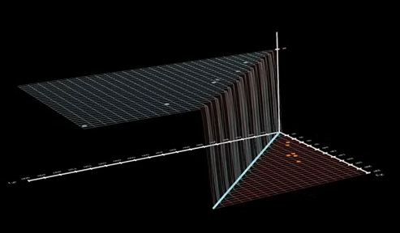

#### 公设条件 3 

那么，我们知道，在现实情况中，这种函数一定不存在，总是会有各种各样的误差和噪声对 `T(X)` 函数产生影响。这里我们用 **ϵ** 表示给函数叠加了一个噪声。它不再变得完美了。函数的输出值依然是会接近 0 和 1。
$$
T(X)+\epsilon=
\begin{cases}
1+\epsilon: X \in {北京} \\
0+\epsilon: X \in {长治}
\end{cases}
$$

这个时候 `sigmoid` 函数就可以派上用场了，我们就可以用它来表示受到噪声干扰后的 `T(X)` 函数。
$$
T(X)+\epsilon=sigmoid(f(X))
$$

图象如下所示：

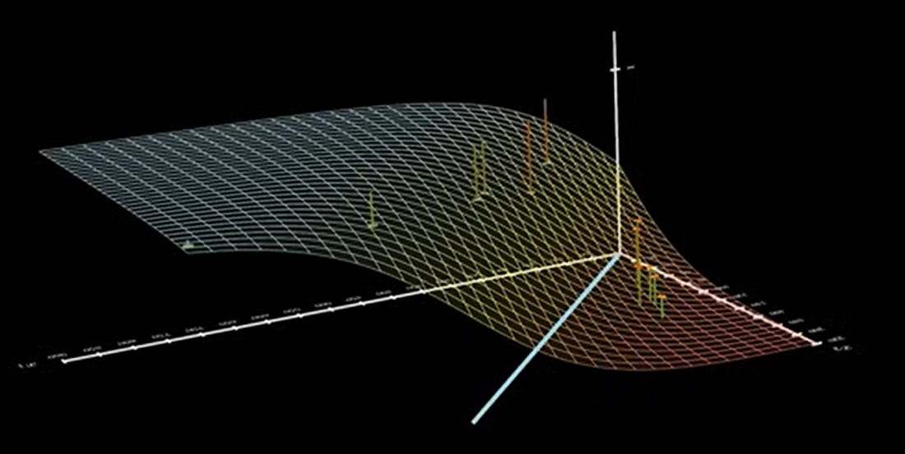

这个时候每一个数据得到的 `sigmoid` 函数值与他们再 T 函数中取值的偏差就是叠加之后的噪声 **ϵ** 。最好的分界线，必然是 **ϵ** 最小的时候对应的分界线。即：**方差最小最好**。

$$
\underset{W}{min}\sum_{i=0}^N(y-\hat{y})^2
$$

$$
y=
\begin{cases}
1: X \in {北京} \\
0: X \in {长治}
\end{cases}
$$

$$
\hat{y}=sigmoid(f(X))
$$

第三种公设的表达式为：
$$
\sigma^2=(y-\hat{y})^2
$$

上述提到的三种公设表示为：

- 粉红色：方差最小最好；
- 橙色：概率最大最好；
- 绿色：间隔最大最好。

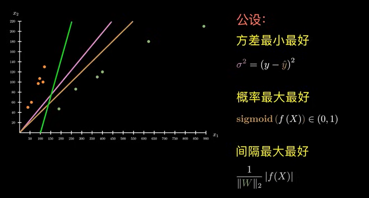

我们知道，公设不同，得到的结果也不同，到底那种结果最好？

没有理论上的标准答案，还是要看真实问题是什么。

这里的三种公设条件可以表示为：
$$
公设：\begin{cases}
修饰公度结果 \\
为公度结果赋予现实意义 \\
用现实意义将一直外推至未知
\end{cases}
$$

所有的公设得到的结果都是对已知现实的总结归纳，是对未知情况的经验总结。

虽然这里写出了判断标准的数学方程，但是求出解析解几乎不可能，困难重重。这里如何选择最合适的算法更快、更好的求出函数表达式的数值解。就是机器学习的另一项重要工作：算法。

虽然算法非常多，但是针对神经网络，提到算法就是在特指 `梯度下降法`。

> 公设的常见叫法是策略。 算法，策略加上模型，就是机器学习的三大要素。

## 机器学习中的模型

### 数据模型分类问题

接下来我们要看的就是模型。模型简单来说就是对`数据的分类`，为什么要选择直线？如下的数据分类图：

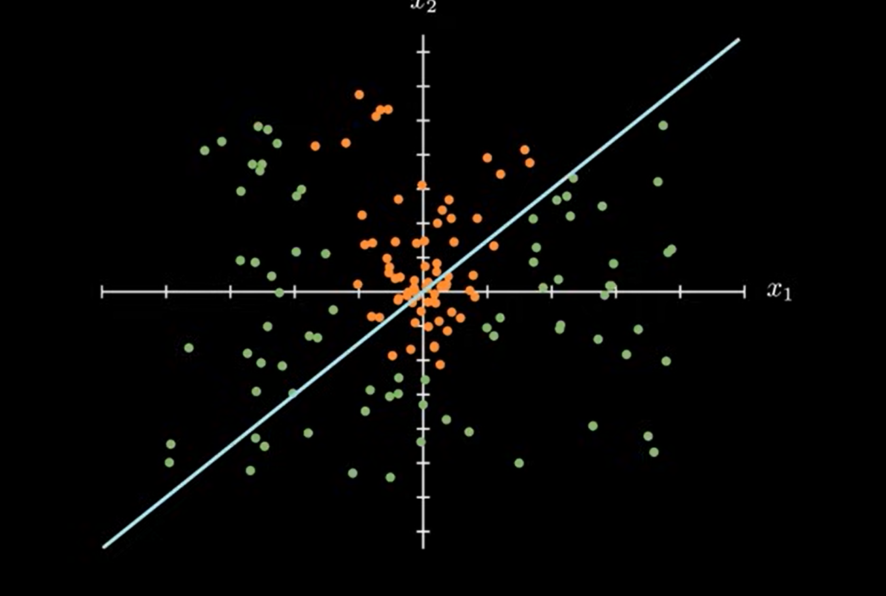

面对这种数据分类的时候，无论直线怎么放置，都会存在问题。但是使用下面的抛物线，就能准确划分数据。

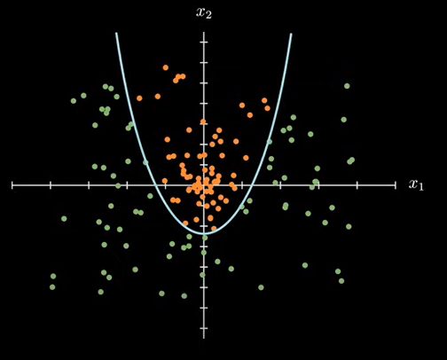

抛物线方程如下：`可以看到相比直线方程，只多了一个 x1 系数的二次项`
$$
w_1x_1^2+w_2x_1-x_2+b=0
$$
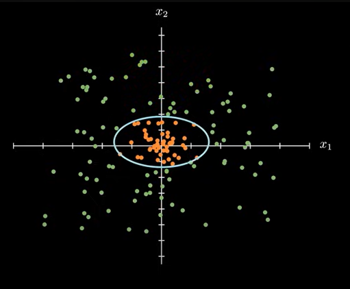

这里，如果我们再增加 一个 x2 维度的二次项，还可以变化成为椭圆形的分界线。
$$
w_1x_1^2+w_2x_2^2+w_3x_1+w_4x_2+b=0
$$
增加 x3 系数的二次项时，会变成双曲线。对数据分类更加准确。

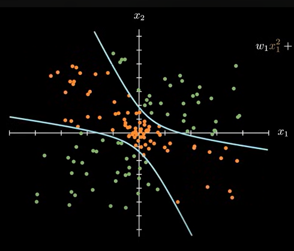
$$
w_1x_1^2+w_2x_22+w_3x_1x_2+w_4x_1+w_5x_2+b=0
$$
> 前人已经证明过，只要增加更多的高次项，那么不论多么奇怪的分割线都可以表示出来。
>
> 随着项数的增加，复杂程度会越来越大。也就是说模型的复杂程度越高。

为了图形表示方便，暂时这里只针对 x1 维度增加更高次项。
$$
\cdots+w_1x_1^3+w_2x_1^2+w_3x_1+w_4x_2+b=0
$$
图像表示为：

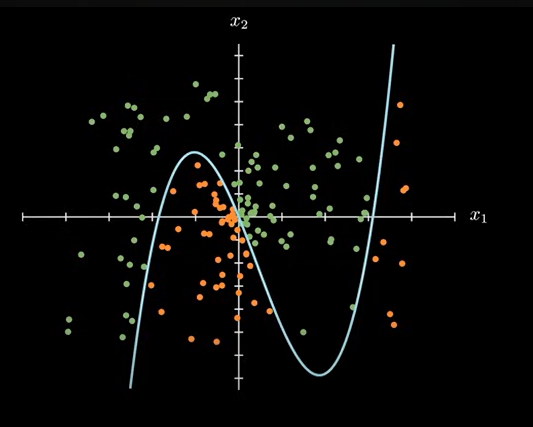

用向量点积的形式表示为：
$$
\left[
\begin{matrix}
\cdots \\ 0.00 \\ 0.00 \\ -0.20 \\ 0.50 \\ 4.60 \\ -1.00 
\end{matrix}
\right]^\mathrm T
·
\left[
\begin{matrix}
\cdots \\ x_1^5 \\ x_1^4 \\ x_1^3 \\ x_1^2 \\ x_1 \\ x_2
\end{matrix}
\right] \\\\
$$
### 分类 & 回归问题

机器学习里讨论的模型复杂程度其实就是曲线的复杂程度。虽然我们这里讨论的是分类问题，其实和回归问题在模型上并没有本质的区别。比如上述的曲线，可以是对数据的分类，也可以看作是对这些数据的拟合。

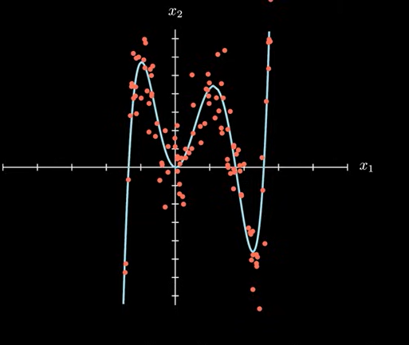

下面我们还是讨论分类问题。

### 引入神经网络

既然直线模型的局限性这么大，我们是不是可以提高模型的复杂程度呢？我们这次讨论的重点——神经网络就是一种提高模型负责程度的方法。

下图就表示一个神经网络：

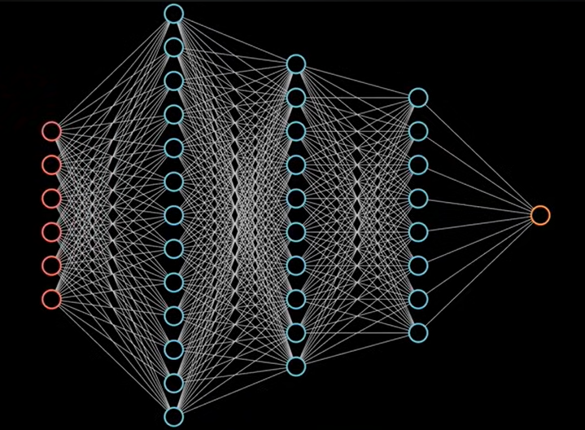

红色表示输入层，输入层的输出输入到神经网络，其中每一个神经元都和上一层，下一层互相连接。称为全连接神经网络。这里，我们单独拿出一个最简单的结构：

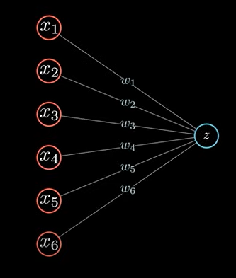

这里的每一条代表的是对应的权重系数。这个结构，其实就表示为一个线性方程，表达式如下：
$$
w_1x_1+w_2x_2+w_3x_3+w_4x_4+w_5x_5+w_6x_6+b=z
$$
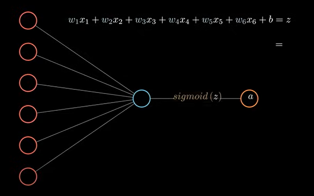

经过 `sigmoid(f(x))` 激活函数计算输出结果到下一层。

### 激活函数

神经网络对激活函数的选择是有要求的，sigmoid 只是符合要求的函数之一。这个激活的过程不会在神经网络中表示出来，只是在神经元中显示。

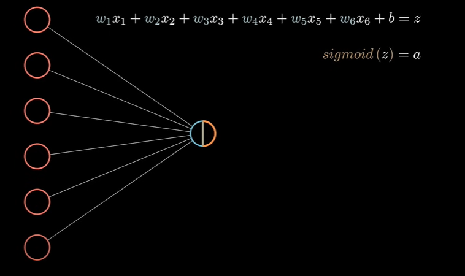

因为后面需要使用坐标系来展示，所以这里只讨论二维情况：

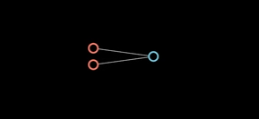

其用向量表示为：
$$
\left[
\begin{matrix}
x_1\\x_2
\end{matrix}
\right]^\mathrm T
·
\left[
\begin{matrix}
w_1\\w_2 
\end{matrix}
\right]
+[b]
= [z]\\
sigmoid(z)=a
\\\\
$$
表达式的输入输出在坐标系中显示为如下图的一个曲面：对应的分界线就是 x1 和 x2 平面上的红色直线。

如果不存在激活函数，就只是一个面，如图：

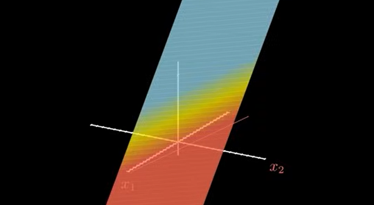

再加入一个神经元时，表示如下：

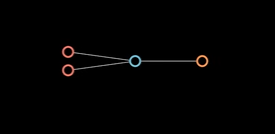

$$
\left[
\begin{matrix}
x_1^{[0]}\\x_2^{[0]}
\end{matrix}
\right]^\mathrm T
·
\left[
\begin{matrix}
w_1^{[1]}\\w_2^{[1]}
\end{matrix}
\right]
+[b^{[1]}]
= [z^{[1]}]\\\\
sigmoid(z^{[1]}=a^{[1]}
\\\\
$$
这里用中括号中的上标数字表示是神经元的第几层。

> 输入层对应的是 0 层。第一层的输出结果会作为第二层的输入。

$$
[a^{1}]^\mathrm T·[w_1^{[2]}]+[b^{[2]}]=[z^{[2]}] \\
sigmoid(z^{[2]}) = a^{[2]}
$$
增加一层神经元之后，图像并不会有多大的变化，仍然是下面这种曲面：

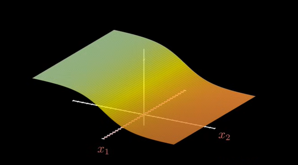

接下来就会发生变化，我们在多加一个神经元之后，

每个神经元都有 `W1, W2 和 b` 一组系数。这时候 W 就不再是向量，而是矩阵。不过仍然是进行线性运算。
$$
\left[
\begin{matrix}
x_1^{[0]}\\x_2^{[0]}
\end{matrix}
\right]^\mathrm T
·
\left[
\begin{matrix}
w_{1.1}^{[1]} \quad w_{2.1}^{[1]}  \\w_{1.2}^{[1]} \quad w_{2.2}^{[1]}
\end{matrix}
\right]
+[b_1^{[1]} \quad b_2^{[1]}]
= [ \quad z_2^{[1]}]\\\\

转置之后：\\\\

\left[
\begin{matrix}
x_1^{[0]}\\x_2^{[0]}
\end{matrix}
\right]^\mathrm T
·
\left[
\begin{matrix}
w_{1.1}^{[1]} \quad w_{2.1}^{[1]}  \\w_{1.2}^{[1]} \quad w_{2.2}^{[1]}
\end{matrix}
\right]
+
\left[
\begin{matrix}
[b_1^{[1]} \\ b_2^{[1]}
\end{matrix}
\right]^\mathrm T

= 
\left[
\begin{matrix}
[z_1^{[1]}] \\ z_2^{[1]}
\end{matrix}
\right]^\mathrm T \\\\
$$

激活函数也变成使用向量表示的形式：
$$
sigmoid(Z^{[1]}) = A^{[1]}
\\
$$

> 这里表示每一项，每一个分量都要经过 `sigmoid` 计算

第二层的输入也会相应变成两个：
$$
\left[
\begin{matrix}
a_1^{[1]}\\
a_2^{[1]}
\end{matrix}
\right]^\mathrm T
·
\left[
\begin{matrix}
w_1^{[2]} \\
w_2^{[2]}
\end{matrix}
\right]
+
\left[
\begin{matrix}
b^{[2]}
\end{matrix}
\right]
= 
\left[
\begin{matrix}
z^{[2]}
\end{matrix}
\right] \\\\
sigmoid(Z^{[2}) = a^{[2]}
$$
此时的图像会变的更加多样：

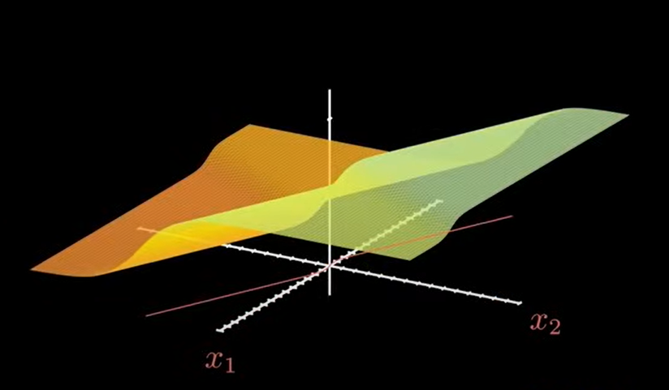

尤其是分界线，已经不止是一条直线了，而是发生了弯曲。

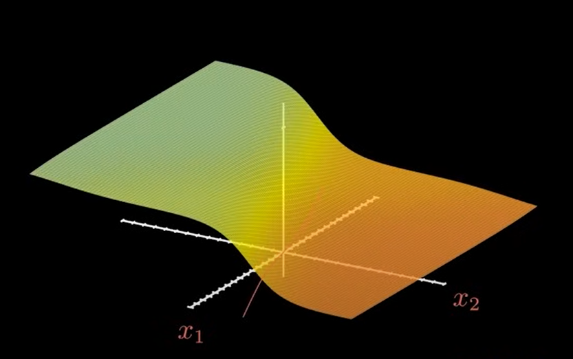

如果我们继续增加神经元，增加到四个：

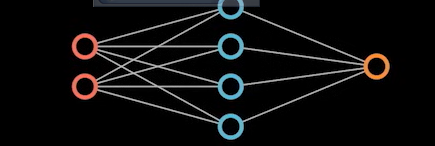
$$
\left[
\begin{matrix}
x_1^{[0]}\\x_2^{[0]}
\end{matrix}
\right]^\mathrm T
·
\left[
\begin{matrix}
w_{1.1}^{[1]} \quad w_{2.1}^{[1]} \quad w_{3.1}^{[1]} \quad w_{4.1}^{[1]}  \\w_{1.2}^{[1]} \quad w_{2.2}^{[1]} \quad w_{3.2}^{[1]} \quad w_{4.2}^{[1]}
\end{matrix}
\right]
+
\left[
\begin{matrix}
[b_1^{[1]} \\ b_2^{[1]} \\ [b_3^{[1]} \\ b_4^{[1]}
\end{matrix}
\right]^\mathrm T

= 
\left[
\begin{matrix}
[z_1^{[1]}] \\ z_2^{[1]} \\ [z_3^{[1]}] \\ z_4^{[1]}
\end{matrix}
\right]^\mathrm T \\\\

\left[
\begin{matrix}
a_1^{[1]}\\a_2^{[1]}\\a_3^{[1]}\\a_4^{[1]}
\end{matrix}
\right]^\mathrm T
·
\left[
\begin{matrix}
w_1^{[2]} \\
w_2^{[2]} \\
w_3^{[2]} \\
w_4^{[2]}
\end{matrix}
\right]
+
\left[
\begin{matrix}
b^{[2]}
\end{matrix}
\right]
= 
\left[
\begin{matrix}
z^{[2]}
\end{matrix}
\right] \\\\
$$

此时图形变化为：

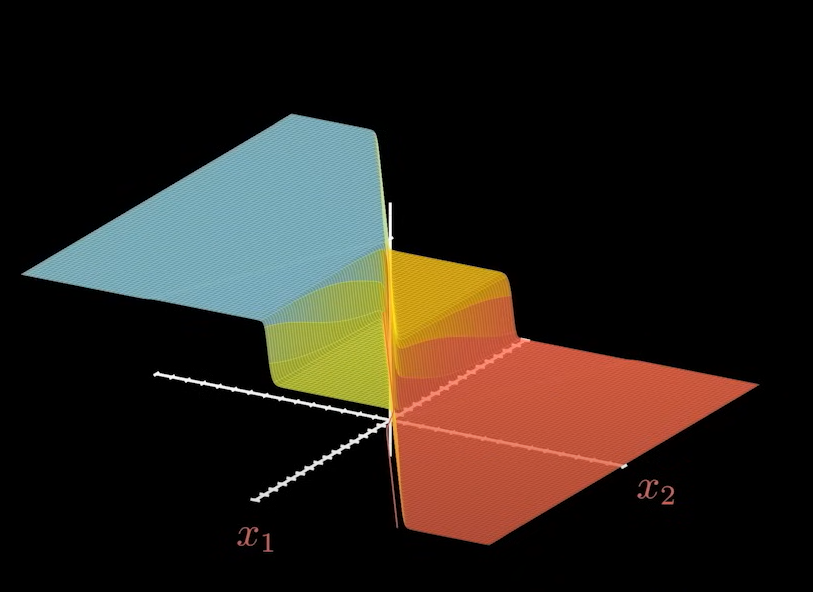

无论是输出结果的曲面，还是分界线，他们的复杂程度大大增加：

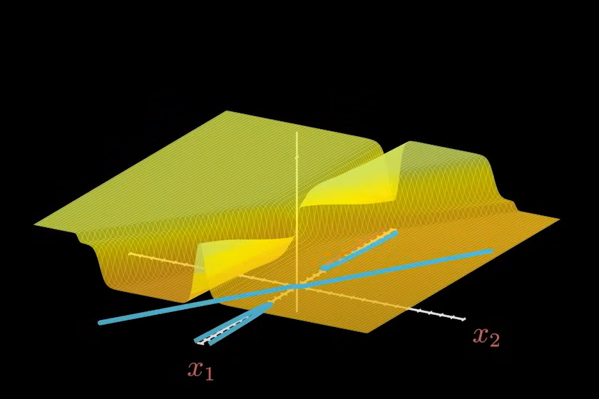

至此，我们持续增加神经元，图形的复杂程度会越来越高。

数据家也证明了，只要增加的神经元足够多，任何一种复杂的曲线都能够被无限的接近表达出来，即万能逼近定理（通用近似定理）。

神经网络要想实现万能逼近，其中有一个关键是`激活函数`。必须是非线性的，如果没有激活函数，再多的神经元也不会增加模型的复杂性。模型的图像只会是一个超平面。常用的激活函数如下：

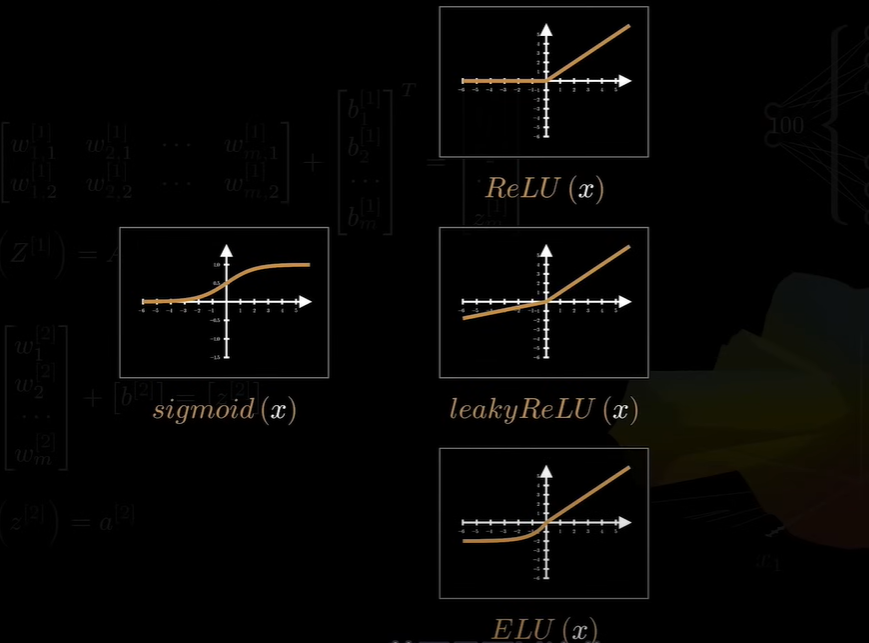

也可以是：`sin(x) sinc(x) Gaussion(x)` 。不同的激活函数对应的图形是非常不同的。

### 激活函数深入

为什么增加更多的神经元会有更强的能力，从另一个角度进行解释。

将前面神经网络部分看作为一个黑盒，不论输入的数据是什么样子，最终输出到最后一个神经元只是一个计算结果。假设他有 10 维。如图：

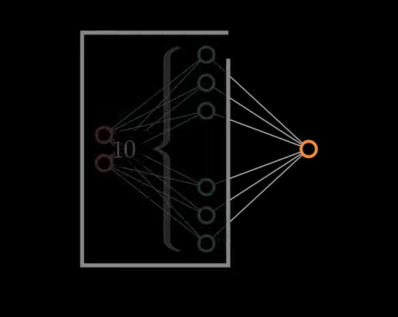

数据从2维到10维。其中的关键是数据的输入进行了一个矩阵运算，矩阵对一个向量进行操作。将其变为另外一个向量：

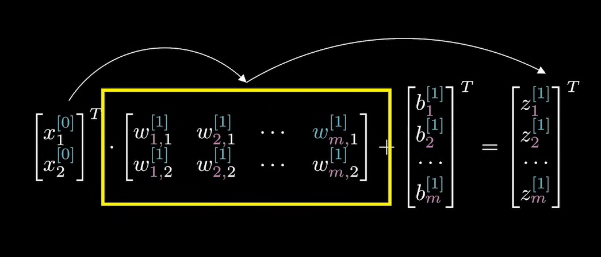

例如如下的向量：
$$
\left[
\begin{matrix}
1\\1
\end{matrix}
\right]
$$
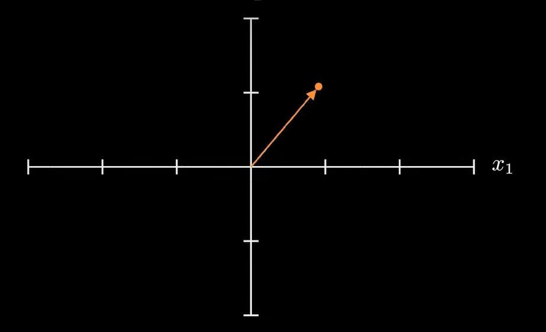

进行如下的运算：
$$
\left[
\begin{matrix}
1\\1
\end{matrix}
\right]
·
\left[
\begin{matrix}
cos\theta \quad -sin\theta\\sin\theta \quad cos\theta
\end{matrix}
\right]
$$
将向量旋转 `θ` 角度：

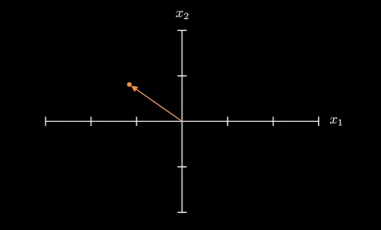

那么这个矩阵的作用就是使向量发生旋转。

那么如下的矩阵，完全可以起到对向量进行升维的作用：
$$
\left[
\begin{matrix}
1\\1
\end{matrix}
\right]
·
\left[
\begin{matrix}
w_{1.1} \quad w_{2.1} \quad w_{3.1} \\
w_{1.2} \quad w_{2.2} \quad w_{3.2} 
\end{matrix}
\right]
$$
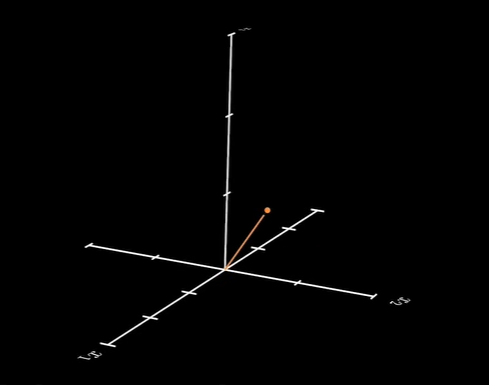

如果数据只是二维的，它们互相参杂在一起，很难直接用直线对数据进行划分：

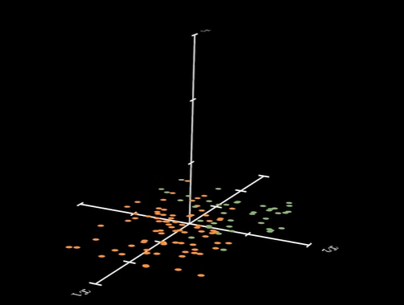

如果对它们进行升维：

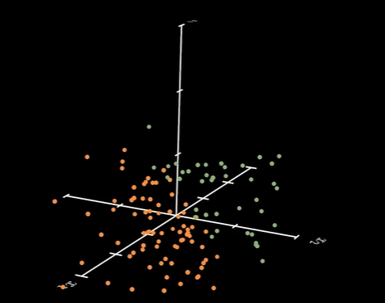

用跟简单的模型也可以将他们分开：

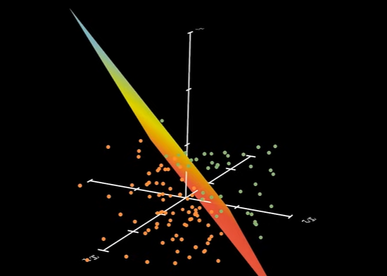

因此，我们可以把神经元中中间的操作看作是数据升维的操作：

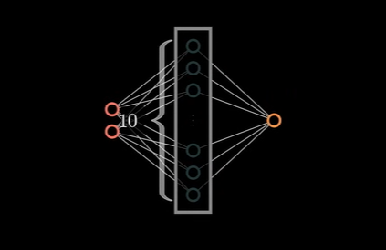

有多少神经元，就会把数据升到多少维。只要维度够高，一定会找到一个超平面，能对数据完成划分。

这样就变成了我们之前讨论的 `f(x)` 问题：

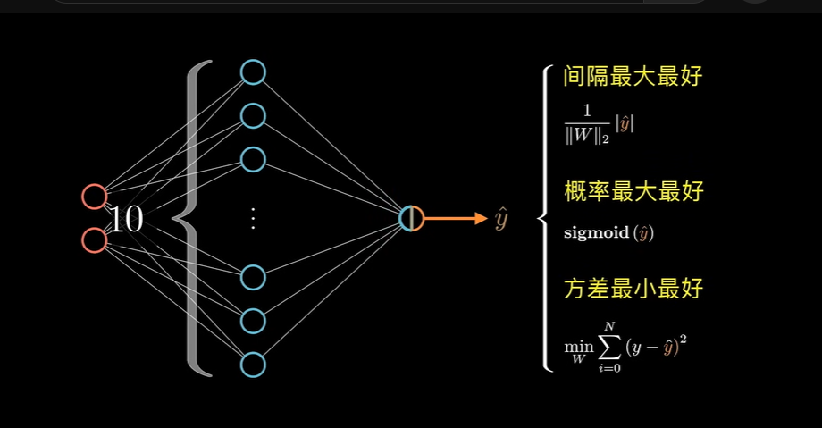

### 多分类问题

一个神经网络并不是只能有一个输出节点，处理二分类问题。也可以有多个节点，进行多分类问题的讨论：


其实质也是在每一个输出节点上进行二分类判断，将各个节点综合起来，就可以去解决多分类问题。真实的场景中，并不像是上述描述的粗糙，而是通过 `softMax(Y)`函数进行统一描述。函数表达式如下：
$$
softMax(\hat{Y}) = \frac{e^{\hat{y_i}}}{\sum_{j=1}^4e^{\hat{y_j}}}
$$
就是对 `singmoid(x)` 函数的扩展和升级。

完整的神经网络如下：


这里的隐藏层暂时理解为对数据进行升维操作。不过更常见的神经网络应该是如下的表示：


基于如上的神经网络，继续使用隐藏层就是对数据升维的看法，就会出现问题，从左到右，神经元的个数在递减。我们仍然回归到简单问题：

神经网络的输入输出可以是：


基于上述神经网络很难有新的发现，我们只需要将问题换成下述这样，就会有新的发现：


### 案例分析  - 判断面部表情 & OCR

上述的数据维度完全可以看作是判断一个人心情的特征。在现实生活中，可没有这么清晰的输入数据去让模型进行判断。而在现实生活中存在可能是这样的一张原始图片：


图片上的每一个像素都是数据的一个维度：


这时候在加入隐藏层：


就可以理解成人类面部表情的特征。

为什么这里反而降维了呢？这是因为这里的一个特征，并不需要原始数据里的所有维度。例如眼睛的动作，我们完全可以只关注眼镜的像素点。

这里隐藏层就可以理解成对上一层原始数据的抽象。

如果只是到此程度的话，还是不能有效的解释为什么神经网络需要这么多层。这时候如果我们换个问题继续理解，就会明白。

比如我们需要使用神经网络去判断手写的数字：


比如数字 8 ，神经网络很可能会将 8 上下两部分的特征提取出来作为判断的依据。如图：


这里将其放在第二个隐藏层的原因是，两个圆可能还有其自己的子特征：


他们都由四部分圆弧组成。这样做的好处是在遇到同样的特征时可以复用，比如数字 6 ，下半部分也是一个圆圈的结构，下面的特征就可以和 8 进行复用。


上半部分的一竖才是数字 6 独有的特征。

对应的数字 5 ，下半部分是半个圆弧，同样也可以进行复用，不同的特征只有上面的 一横 这一部分。


对神经网络的层数可以理解为：隐藏层越深，对数据的抽象程度越高。

> 这里只是用了我们人能理解的特征进行描述，神经网络自己学习到的特征，可能人无法理解，但是预测结果同样十分准确。

上述的就是对一个完整的神经网络的描述。


> 模型  -> 隐藏层
>
> 策略 -> 输出层
>
> 其实在输入层也需要对数据进行预处理。随着算力需求越来越大，如何对数据进行预处理使其得到最佳结果。也是一个非常重要的问题。

## 算法 - 梯度下降算法

在神经网络中，这个算法没有别的，就是反向传播（梯度下降）算法。


### 算法推导

一个神经网络我们完全看作是一个这样的函数：
$$
f_w(X) = \hat{Y}
$$
只不过这个函数相当复杂而已。如果神经网络已经训练成功，在进行判断和决策的时候，他们的输入就是 X 系数 W 是作为参数。这个过程称之为正向传播。但是，如果一个神经网络正在被训练，他们之间的关系就会变得相关。
$$
f_X(W) = \hat{Y}
$$
x 作为已知的参数，系数作为变量，是需要求解的。因此，函数的图像也会发生相应的变化。如图为一个正向传播的函数图像：


如果将系数 W 看作变量的话，坐标不再是 x1 和  x2 而是 w1 和 w2。


上图为一个简化处理，这里我们假设不知道神经网络的具体情况，只是将 所有的系数看成是一个向量。后面我们会修正图像。这里的最高点就是我们在选择策略后希望出现的结果。


我们这里的结果不是求出 Y 的值，而是求出令 Y 最大时 W 的取值。

这个 W 的取值就是最高点在系数平面上的投影：


不过，我们在初始化一个神经网络的时候，系数 W 可能出现在任何一个位置，理想情况下，他到最优点的距离就是我们求解的目标：


$$
f_x(W^*) = \hat{Y_*} \\\\
W - W^* = \Delta{W}
$$
但是在实际场景，上述 W 的值很难直接计算出来。如果利用如下的方式，我们就可以求出：

在曲面上的任意一点：都可以求出一个向量：


这个向量总是指向上升最快的方向：


那么这个向量在参数平面上的`投影`就叫做 `梯度`。


梯度总是指向上升最快的方向，那么为何称为梯度下降法呢？在选择策略的时候，有的策略是求最大，有的是求最小。为了将其统一看待，即便是求最大的问题，我们也可以在其上加上负号使其变成求最小的问题。


不过虽然的这里曲面反了，但是梯度仍然是指向上升最快的方向。所以在具体操作的时候，会对梯度先求反，这样梯度就会指向下降最快的方向。这就是这个算法  `梯度下降法`的由来，不过其本质仍然相同。


### 梯度下降法在模型中的应用

梯度总是指向上升最快的方向，即总是和等高线垂直。梯度本身是一个向量，所以就代表了他在所有参数维度上都有分量。


如果所有的参数都按照梯度的分量进行调整，这样就代表参数 W 做出了当前情况下最好的选择。
$$
\left[
\begin{matrix}
w_1\\w_2 \\ \cdots
\end{matrix}
\right]
\pm
\left[
\begin{matrix}
\Delta{w_1}\\\Delta{w_2} \\ \cdots
\end{matrix}
\right]
$$
一次次慢慢移动，总会接近其级值点。


即便在这样的场景下，仍然存在问题，梯度只是指向了上升最快的方向，而没有指出其上升时每一步的步长。

步长在梯度下降法中通常用 η 来表示，也就是通常所说的学习率了。
$$
\left[
\begin{matrix}
w_1\\w_2 \\ \cdots \\ \cdots
\end{matrix}
\right]
\pm
\eta ·
\left[
\begin{matrix}
\Delta{w_1}\\\Delta{w_2} \\ \cdots \\ \cdots
\end{matrix}
\right]
$$
它是一个超参数，不能由神经网络学习得到，需要手动进行配置。

> η 过大就会很快接近极值点，但是会造成反复横跳，无法收敛的结果。
>
> η 过小，整体路径最优，移动相同次数，移动距离会比较短。
>
> 现在已经有了很多梯度下降的进阶方案。

### 算法实践

现在我们已经理解了其思路，如何求出梯度？就是如何求出分量的具体值。如果非常笼统的看待：求梯度的答案为对函数求偏导。每一个变量的维度都要求偏导。
$$
\left[
\begin{matrix}
w_1\\w_2 \\ \cdots \\ \cdots
\end{matrix}
\right]
\pm
\eta ·
\left[
\begin{matrix}
\frac{\partial{f}}{\partial{w_1}}\\\frac{\partial{f}}{\partial{w_2}}\\ \cdots \\ \cdots
\end{matrix}
\right]
$$
上述中的梯度也可以用 ∇f 表示，读作 nablaf。

接下来的问题是具体如何求出偏导。如果我们把神经网络整体看作是一个黑盒。


> 输入层是 X 不同的系数 W 对应不同的 Y 值。w 全部在黑盒中。

所谓的梯度下降便是：将计算出来的梯度反向传播到神经网络中，让所有的 W 进行修改。


对于神经网络麻烦的一点是：不同的 W 之间是存在依赖关系的，不是单独存在。这个依赖关系就是神经网络的结构图。因此要想计算出每个系数对应梯度的分量还需要将黑盒拆开才行。那么，这个黑盒里面到底是什么？

其本质就是如下图中的三行表达式：


这里的表达式都是在进行向量计算，所以为了后面的表达方便，将其使用下面的形式表示：
$$
ReLU(X·W^{[1]}) = A^{[1]}
\\
f_k^{[1]}(W^{[k]}_1) = a^{[1]}_k
\\\\
ReLU(A^{[1]}·W^{[2]}) = A^{[2]}
\\
f_j^{[2]}(A^{1},W^{[2]}_j) = a^{[2]}_j
\\\\
softmax(A^{2},W^{[3]})
\\
f_i^{[3]}(A^{2},W^{[3]}_i) = a^{[3]}_i
$$
其中 i,j,k 分别对应这一层不同的神经元。

我们先来分析最下面这一个表达式：它表示的是某一个节点上要完成的计算。


它的梯度等于：对所有变量的维度求偏导。
$$
\nabla{f_i^{3}} = 
\left[
\begin{matrix}
\frac{\partial{f^{[3]}_i}}{\partial{w^{[3]}_{i,1}}}
\\
\frac{\partial{f^{[3]}_i}}{\partial{w^{[3]}_{i,2}}}
\\ \cdots
\\
\frac{\partial{f^{[3]}_i}}{\partial{a^{[3]}_{1}}}
\\
\frac{\partial{f^{[3]}_i}}{\partial{a^{[3]}_{2}}}
\\
\cdots
\end{matrix}
\right]
$$
这里同时也要对 A 求偏导，因为 A 也是一个当前节点的输入数据，关系如下：

我们在考虑之前一个神经元的参数求导时，需要结合前面一层神经元的影响，即 J 层的 a 系数的偏导表达式为：
$$
W_j^{[2]} \pm \eta^2·\frac{\partial{f_j^{[2]}}}{\partial{W_j^{[2]}}}\sum_{i=1}^4\frac{\partial{f_i^{[3]}}}{\partial{f_j^{[2]}}}
$$
K 层的偏导系数的表达式为：
$$
W_k^{[1]} \pm \eta^3\sum_{j=1}^7\sum_{i=1}^4\frac{\partial{f_k^{[1]}}}{\partial{W_k^{[1]}}}\frac{\partial{f_j^{[2]}}}{\partial{f_k^{[1]}}}\frac{\partial{f_i^{[3]}}}{\partial{f_j^{[2]}}}
$$
如果反向传播的次数越多，那么学习率的次数就越高。我们知道学习率往往是小于 1 的，那么经过次方运算之后再和梯度相乘，就不会对参数做出多少调整，这也是我们经常说的梯度消失问题。

## 总结

到这里为止，就描述完了神经网络里的模型，算法和策略。
