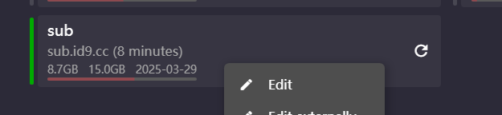
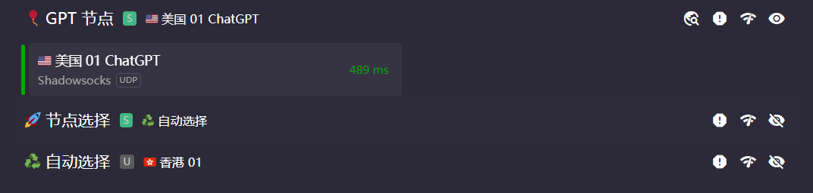
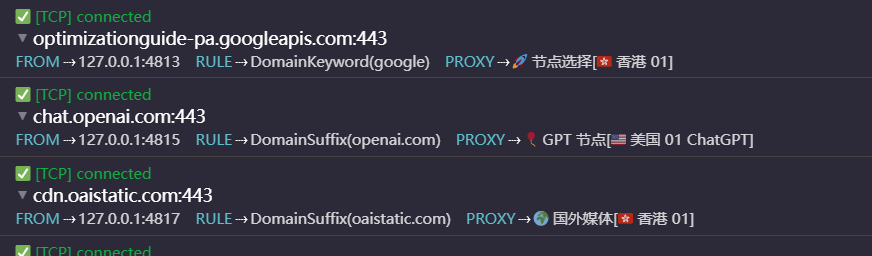

# Clash 自定义规则教程

> 在使用 Clash 的时候，有的时候需要特定的流量由特定的节点代理。
>
> **e.g. openai 的流量全部走美国节点。**

## 订阅转换

地址：https://acl4ssr-sub.github.io/

使用其转换的原因是为了最规则做固定节点分组。在转换完成之后，将转换的订阅连接导入 clash，和往常导入规则步骤一致。

转换前：


转换后：


转换之后可以更好的设置自定义规则！

## 自定义规则

在转换导入之后的规则订阅上单击：找到 `edit` 选项。



找到如下的配置项：

```yml
proxy-groups:
  # 这里是抽取出来的节点序列，即希望自定义规则代理流量时的节点序列
  - name: 🎈 GPT 节点
    type: select
    proxies:
      # 可以从下面选择，这里因为 openai 封禁亚洲 IP，所以选择美国节点。
      - 🇺🇸 美国 01 ChatGPT
  - name: 🚀 节点选择
    type: select
    proxies:
      - ♻️ 自动选择
      - DIRECT
      - 🇭🇰 香港 03
      - ....
  - name: ♻️ 自动选择
    type: url-test
    url: http://www.gstatic.com/generate_204
    interval: 300
    tolerance: 50
    proxies:
      - 🇭🇰 香港 03
      - 🇭🇰 香港 01
      - ....
  - name: 🌍 国外媒体
    type: select
    proxies:
      - 🚀 节点选择

```

设置完成之后的效果如下所示：



之后可以将需要的网址设置到指定的节点序列上：(尽量往前设置)

```yml
- DOMAIN-SUFFIX,openai.com,🎈 GPT 节点
- DOMAIN-SUFFIX,openaiapi-site.azureedge.net,🎈 GPT 节点
```

## 验证

在 logs 中可以看到，openai.com 后缀结尾的流量全部走了 GPT 节点序列。其他流量走默认节点序列。

